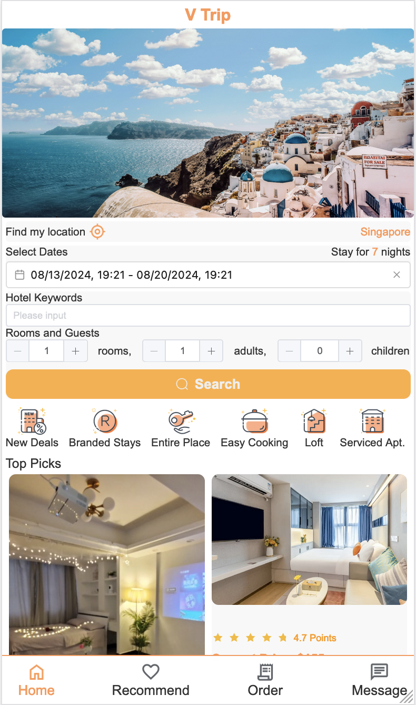
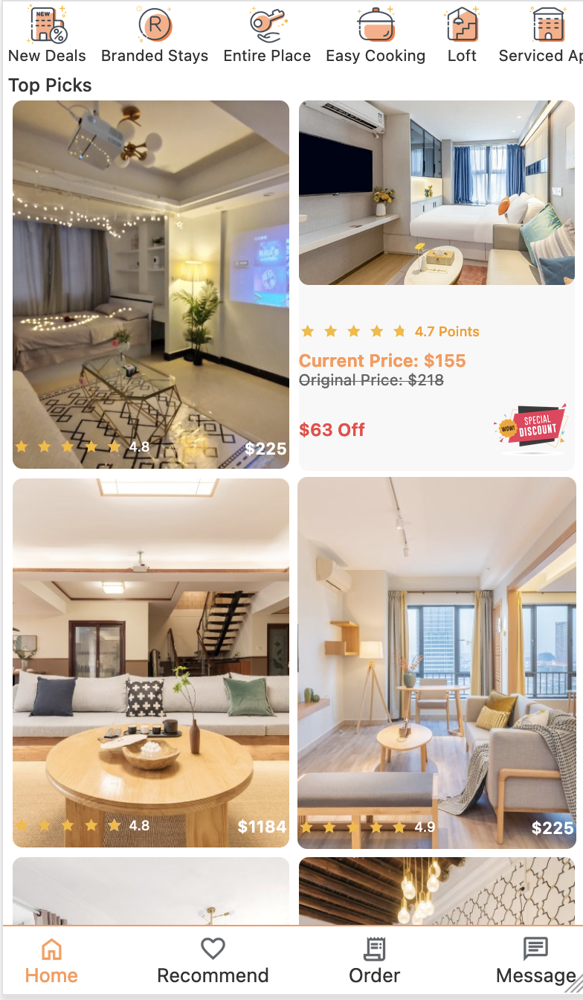
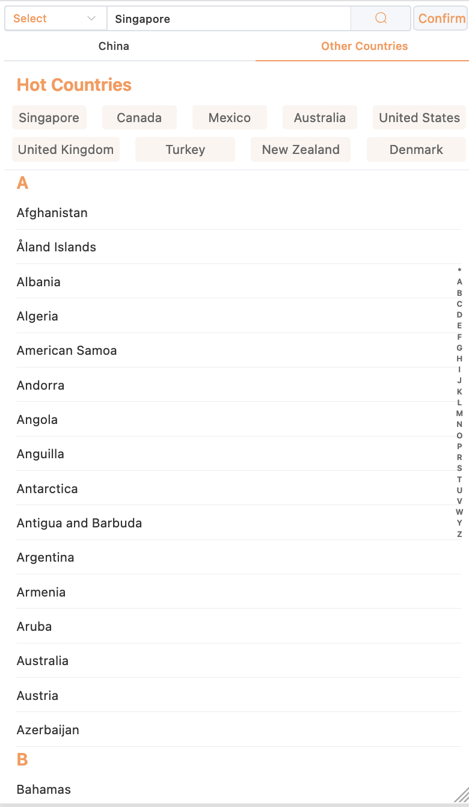

# V Trip

**V Trip** is a Vue 3 application modeled after leading travel websites, designed to help users select hotels based on their travel needs. The project utilizes HTML, CSS (Less), and JavaScript with an emphasis on mobile responsiveness. 📱

**Key Features:**

- **Routing:** Implemented with Vue Router, facilitating navigation across 7 primary views. 🗺️
- **State Management:** Managed using Pinia. 📦
- **Home Page:** Features include user location detection, stay duration calculation, and infinite scrolling with throttling to load room data incrementally. 🌍
- **Location Selector Page:** Includes tab pane switching, hot choices display, and an alphabetical listing of cities and countries. 🏙️

Future enhancements will focus on completing additional functionalities. 🚀

## Project Screenshots

### Screenshot of Home Page


### Screenshot of Home Page's Room List


### Screenshot of Location Selector Page



## More Info:

**Technical Stack:**

- **Vue 3:** Leveraging the latest version of Vue.js for a modern, reactive user interface. 🔧
- **Vue Router:** For managing application routing and navigation. 🧭
- **Pinia:** For state management, providing stores with reactive state and actions. 📈
- **CSS (Less):** Utilizing Less for advanced styling and theming. 🎨
- **Axios:** For making HTTP requests to fetch data. 🌐
- **Element Plus, Vant3, and Vue3 DatePicker:** Utilizing these component libraries for enhanced UI components and functionality. 🛠️
- **Vite:** For a fast and optimized development build tool, improving build speed and developer experience. ⚡

**Development Tools:**

- **VSCode:** Using Visual Studio Code as the primary IDE for development. 💻

**Performance Optimization:**

- **Lazy Loading:** Implemented lazy loading of components and routes to improve initial load times. ⏳
- **Throttling:** Applied throttling techniques using the underscore library to optimize infinite scrolling and avoid excessive network requests. 🚦

**Accessibility:**

- **Responsive Design:** Ensuring compatibility with various screen sizes and devices through responsive design practices. 📱

**Testing:**

- TBD

**Deployment:**

- Plan to use AWS and Nginx. ☁️

## Development Log

06/08/2024: Router + TabBar + Home Page's Banner + Location Display Done ✔️

07/08/2024: Locate + Location Selector Page Done ✔️

08/08/2024: Location Selector Page's Hot Choices Display + Home Page's Calendar Feature Done ✔️

09/08/2024: Home Pages' Booking Info Display Done ✔️

10/08/2024: Home Page's Search Button + Room Categories Section Done ✔️

11/08/2024: Home Page's Room List Part I (Display) Done ✔️

12/08/2024: Home Page's Room List Part II (Scroll to Fetch More Data) Done + Router Functionality Improved ✔️

13/08/2024: Home Page Done ✔️

## Project Setup

```sh
npm install
```

### Compile and Hot-Reload for Development

```sh
npm run dev
```

### Compile and Minify for Production

```sh
npm run build
```
